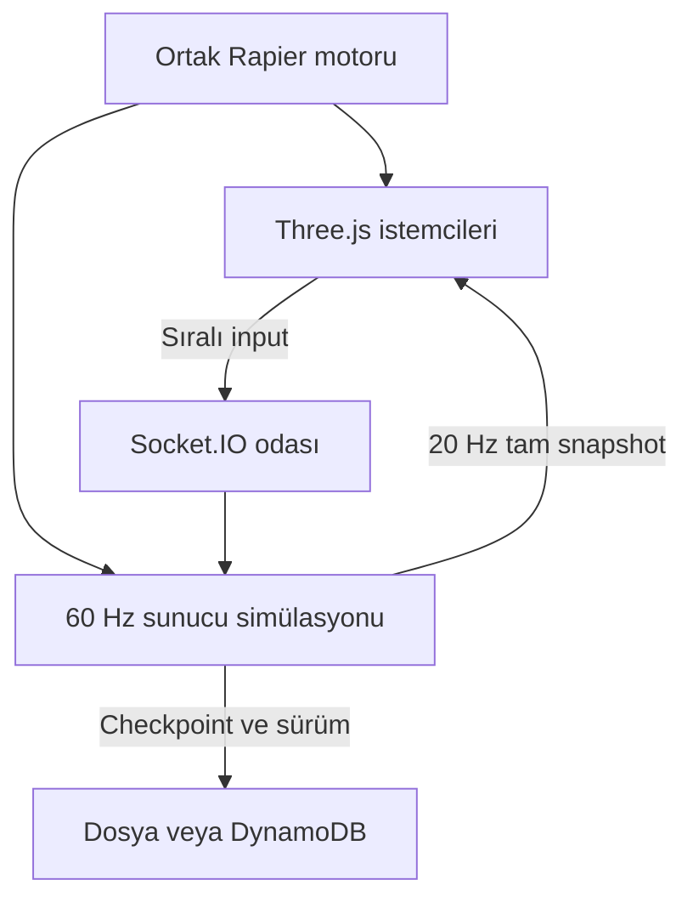

# Sistem mimarisi

## Yetki sınırı

Sunucu pozisyon, hareket yetenekleri, terminal yakınlığı, bulmaca sonucu ve ilerlemede tek otoritedir. İstemci sadece sıralı input komutları üretir. Sunucuya pozisyon, animasyon, elapsed time veya `doorOpen=true` gönderilerek bunlar değiştirilemez. Avatar animasyon durumu kabul edilmiş fizik simülasyonundan türetilir.



## Simülasyon / ağ bütçesi

| Parça | Uygulanan değer / davranış |
|---|---|
| Sunucu fizik adımı | 60 Hz; sabit `DT=1/60` |
| Yerel tahmin | Aynı motor, aynı sabitler, 60 Hz |
| Input taşıma | 3 adım bir pakette, hedef 20 paket/sn |
| Snapshot | Her 3 simülasyon adımında, 20 Hz |
| Kapasite | Oda başına 6, varsayılan süreç başına 32 oda üst sınırı |
| Gelen input kuyruğu | Oyuncu başına en çok 12; tick başına en çok bir komut |
| Gelen komut bütçesi | 90 komut/sn, 120 başlangıç/burst jetonu |
| Socket payload sınırı | 8 KiB |
| İstemci tahmin sınırı | 90 onaysız komut; sonra snapshot bekler |
| Uzaktaki avatarlar | 100 ms interpolation; en çok yaklaşık 50 ms extrapolation |
| Kayıt | Checkpoint olayları + yaklaşık 15 sn |

Input paketinde `dt` bulunmaz; bir istemci daha büyük zaman adımı göndererek hızlanamaz. Her tick en çok bir komut işlenmesi ve input eksikliğinde nötr hareket kullanılması fizik hızını sınırlar. Input yokken yerçekimi devam eder. Terminal basılı durumu kısa paket boşluklarını tolere etmek için en çok 180 ms tutulur; bu süre sunucuda sınırlandırılır.

Snapshot taşıması `volatile`: eski snapshot birikmesi tercih edilmez, sonraki tam durum kaybı telafi eder. Input paketleri sıralı normal emit kullanır. Socket.IO varsayılanı uçtan uca tam bir exactly-once sistemi değildir; kopmada gelen/giden bazı olaylar kaybolabilir. Bu nedenle yeniden bağlantıda eski inputlar atılır ve tam oda durumu alınır. [Socket.IO teslim garantileri](https://socket.io/docs/v4/delivery-guarantees/).

`seq` işlenmiş input onayıdır. `epoch` ölüm, sektör değişimi veya yeniden katılım sonrası eski komutları geçersiz kılar. Oda epoch'u sektör yüklemesini, karakter epoch'u input ömrünü ayırır.

İstemci düzeltme adımları:

1. Sunucunun karakter durumunu al: pozisyon, dikey hız, grounded, coyote, dash yönü/süresi, cooldown, wall-run süresi, seq, epoch.
2. Onaylanan inputları pending listesinden çıkar.
3. Tam hareket durumunu motorun içine geri yükle.
4. Kalan inputları ortak Rapier dünyasında yeniden çalıştır.
5. Küçük görsel hatayı kısa bir üstel yumuşatmayla erit; 3 metreden büyük düzeltmeyi anında uygula.

Yerel fizik otoriteli düzeltmeyi hemen kullanır; yumuşatma yalnızca çizimde yapılır. Ortak motor deterministikliğe yardımcı olur ama her platformda bit düzeyinde eşitlik varsayılmaz. Köprü için tarihsel dünya rollback'i yoktur: replay güncel otoriteli collider durumunu kullanır. Köprü kapanışında kısa bir düzeltme mümkündür. Gerçek gecikme/jitter altında hissiyat testi yapılmalıdır.

HUD'daki `ms · onay`, komut üretiminden sunucunun bu komutu içeren snapshot'ına kadar geçen süredir; saf ping/RTT değildir. Batching, sunucu kuyruğu ve snapshot aralığını içerir. “Gecikmesiz online” garantisi verilmez.

## Hareket ve kamera

`shared/simulation.js` içindeki `CharacterMotor`, Rapier'ın standalone capsule collider ve `KinematicCharacterController` API'sini kullanır. KCC istenen yer değiştirmeyi çarpışmalara göre düzeltir; kapsüle düzeltilmiş pozisyon atanır, ardından dünya adımı yapılır. Bu kullanım Rapier'ın doğrudan collider kontrolü akışına uygundur. [Rapier kontrolcü rehberi](https://rapier.rs/docs/user_guides/javascript/character_controller/).

- Yerçekimi ve zıplama motor tarafından sayısal hesaplanır; her oyuncu için dinamik rigid-body çözümü yoktur.
- Dünya statik box collider'lardan oluşur; render mesh'i collider olarak kullanılmaz.
- Otomatik basamak yüksekliği 0,25 m; zemin yakalama 0,18 m; tırmanma eğim sınırı 45°.
- Wall-run: sprint + havada hareket + yakın dik duvar. İki yan ray ile normal alınır, hareket duvarın teğetine izdüşürülür, yerçekimi azaltılır. Süre 1,15 sn, zemine inince yenilenir.
- Dash: 19 m/sn, 0,16 sn, 1,2 sn cooldown. Teleport yapılmaz; KCC hareket taraması duvarları hesaba katar.
- Oyuncular birbirlerini fiziksel itmez; griefing ve kapsül yığını kararsızlığı azalır. Yardımlaşma terminal görevi üzerinden zorunlu tutulur.
- FPS / TPS geçişinde karakter collider'ı değişmez. `CameraRig` yalnızca kafa noktasına uzaklığı üstel yumuşatır.
- Kamera engel kontrolü center ray ve 0,25 m güvenlik payı kullanır. Karmaşık dar geometride near-plane köşeleri için sphere cast veya çoklu ray eklenebilir; mevcut basit geometriyle başlanmıştır.
- Animasyonlar low-poly avatar uzuvlarının prosedürel dönüşüdür; hazır GLTF karakter klipleri içermez. `state.animation` ileride AnimationMixer kliplerine eşlenebilir.

## Co-op bulmacası ve fizik

`server/src/puzzle.js` dışarıdan bir `open` komutu dinlemez. Oda her tick sunucudaki oyuncu konumlarını ve doğrulanmış E durumunu bu fonksiyona verir.

1. A'ya 2,4 m yakın ve E basılı oyuncu operatör olur.
2. Köprü en fazla 8 sn çalışır. E bırakılırsa, operatör uzaklaşırsa veya bağlantısı kesilirse kapanır.
3. 1 sn yeniden etkinleştirme beklemesi vardır; A'da kalan operatör yeni deneme için tekrar enerji verebilir.
4. Farklı bir oyuncu B'ye 2,4 m yaklaşıp E'ye basarsa köprü kalıcı kilitlenir.
5. `bridgeCollider.setEnabled(true)` ve `exitGateCollider.setEnabled(false)` sunucuda uygulanır.
6. Snapshot'taki aynı `puzzle` durumu istemcinin collider'ına ve görünür mesh'lerine uygulanır.
7. Kalıcı kilit kayıt altına alınır; operatör serbest kalıp köprüden geçebilir. Tek oyuncu iki terminal arasında hızla dolaşarak kilidi açamaz.

Kapanan köprü üstündeki oyuncu düşer ve checkpoint'e döner. Kapı açılma animasyonu yerine collider ve mesh görünürlüğü anlık değiştirilir; anlaşılır ve ucuz bir başlangıç uygulamasıdır. Geç gelen istemci de tam snapshot aldığı için mevcut kapı durumunu öğrenir.

Sektör tamamlanması için bağlı oyuncuların tamamı çıkış bölgesinde ve en az iki bağlı oyuncu bulunmalıdır. Bağlantısı kopan oyuncu kalan takımı sonsuza kadar bloke etmez. İlerlemiş sektöre sonradan katılan yeni gezgin o sektörün başlangıcında doğar.

## NoSQL kayıt modeli

Örnek kayıt; alan değerleri temsili:

```json
{
  "PK": "SESSION#K9P2RX",
  "SK": "STATE",
  "room": "K9P2RX",
  "schemaVersion": 1,
  "levelVersion": 1,
  "version": 12,
  "sector": 1,
  "completed": false,
  "elapsedSeconds": 930,
  "puzzle": { "latched": true, "participants": ["guestHashA", "guestHashB"] },
  "roster": {
    "guestHashA": { "name": "Gezgin", "sector": 1, "checkpoint": 1, "updatedAt": "2026-09-05T12:00:00Z" }
  },
  "updatedAt": "2026-09-05T12:00:00Z"
}
```

Odayı yüklemek tek `GetItem`, checkpoint yazmak tek `PutItem`. `PK/SK` tasarımı daha sonra `SK=PLAYER#...` ve `SK=EVENT#...` gibi kayıt türlerini aynı oturuma eklemeye uygundur. Bu prototip roster'ı tek öğede en fazla 64 misafirle sınırlar; sınırsız pozisyon/event geçmişi eklemez. Sık hareket verileri RAM'de kalır.

`version` optimistic concurrency alanıdır. İlk yazım `attribute_not_exists(PK)`, sonraki yazım `version = expectedVersion` koşulu kullanır. Her odanın yazımları sıraya alınır; eski bir asenkron yazı yeni checkpoint'i ezemez. Koşullu yazım DynamoDB'nin desteklediği mekanizmadır. [AWS koşul ifadeleri](https://docs.aws.amazon.com/amazondynamodb/latest/developerguide/Expressions.ConditionExpressions.html).

Çakışma oluşursa kayıt hata durumunda kalır ve retry yapılır; başka düğümün kaydını zorla ezmek için koşul kaldırılmaz. Otomatik cross-node birleştirme bu prototipte yoktur. Gerçek çok düğümlü sürümde tek oda sahibi + lease/fencing tasarımı gerekir.

Dosya adaptöründe temp dosya + rename kullanılır. Tek Node süreçli geliştirme içindir; aynı dizine birden fazla süreç yazdırılmaz. Süreç çökerse son başarıyla tamamlanmış checkpoint yüklenir; son saniyelerdeki henüz yazılmamış durum kaybolabilir.

## Performans ve büyüme

Uygulanan tasarruflar: paylaşılan box geometrileri ve materyaller; zemin ışık şeritleri / uzay enkazında InstancedMesh; 650 noktalık tek yıldız çizimi; pahalı gölge ve postprocessing yok; pixel ratio en çok 1,5; fizik collider'ları sadece oyun geometrisinde; dünya değişirken fizik dünyası ve etiket dokuları serbest bırakılır. Uzak karakterlerin istemci tarafında fizik simülasyonu yoktur. Aynı anda yalnızca mevcut sektör aktiftir.

Başlangıç bütçeleri (ölçülmüş sonuçlar değil): entegre GPU'da 720p/1080p için 30–60 FPS, görünür sahnede 150 draw call altı, 75 bin üçgen altı. Hedef cihazlarda `renderer.info`, frame-time p50/p95, fizik tick p95 ve RAM ölçülmeli. 6 oyunculu JSON snapshot trafiği için önce gerçek bayt ölçümü yapılmalı; gerekirse pozisyonları quantize et, isim/roster'ı seyrek gönder ve delta snapshot ekle.

Mevcut `rapier3d-compat` paketi WASM'ı JS içine gömer; Three.js ile derlenen ana bundle yaklaşık 3,45 MB (gzip raporu yaklaşık 1,25 MB). Bu ilk indirme büyüklüğüdür, sürekli trafik değildir. Sunucunun basit statik handler'ı kendi başına gzip üretmez; reverse proxy/CDN sıkıştırmasını ayrıca aç. Sonraki aşamada ayrı WASM / vendor cache veya gecikmeli motor yüklemesi düşünülebilir.

Çok süreçli üretim planı:

- HTTPS giriş noktası + kullanıcıya yakın bölge + oyun süreci başına ölçülmüş oda kapasitesi.
- Oda kodunu tek simülasyon sahibine yönlendiren room directory ve sahiplik lease'i.
- Socket.IO Redis adapter yayın iletimine yardımcı olur; Rapier dünyalarını veya oyun otoritesini kendiliğinden birleştirmez. [Socket.IO odaları](https://socket.io/docs/v4/rooms/).
- Oda süreci kaybolduğunda son checkpoint'ten yeni owner üzerinde yeniden katılım; canlı fizik durumu kayıpsız taşınması ayrıca geliştirilmelidir.
- Tam hesap / davet yetkisi, merkezi IP/hesap hız limiti ve telemetri genel erişime açılmadan önce eklenmeli. Mevcut oda kodu arkadaşlar arası davet kolaylığıdır; özel oda ACL'si değildir. Token hash'i istemciye ham token sızdırılmasını engeller, hesap kimliği yerine geçmez.

Bulut deployment, load balancer, Redis veya canlı DynamoDB hesabı bu teslimde oluşturulmadı. Verilen kod tek Node sürecinde gerçek online co-op temeli olarak çalışır.
